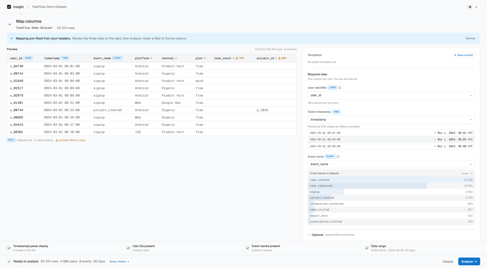

# Changelog

All notable changes to this project will be documented in this file.

The format follows [Keep a Changelog](https://keepachangelog.com/en/1.1.0/).

## [Unreleased]

### Added
- Added this changelog.
- Redesigned the column mapping screen with a larger data preview, a focused right-side mapping panel, and a sticky readiness/action dock.
- Added hover highlighting between mapped fields and their corresponding preview columns.
- Added a dismissible mapping guidance banner and warning hints for partially filled property columns.
- Restored mapping templates in the redesigned mapping panel.

## [0.2.0] - 2026-05-27

### Added
- Added data readiness checks to the column mapping flow.
- Added a backend quality endpoint for mapped event datasets.
- Added an expandable property quality summary with `+N more` and `Show less`.
- Added `VITE_API_TARGET` support for local API proxy overrides.

### Changed
- Prevented analysis from starting while data readiness checks are still running or blocked.

## [0.1.0] - 2026-05-25

### Added
- Initial product analytics workflow with CSV upload, column mapping, dashboard, AI insights, and Q&A agent.
- Added the built-in TaskFlow demo dataset and pre-computed demo AI playback.
