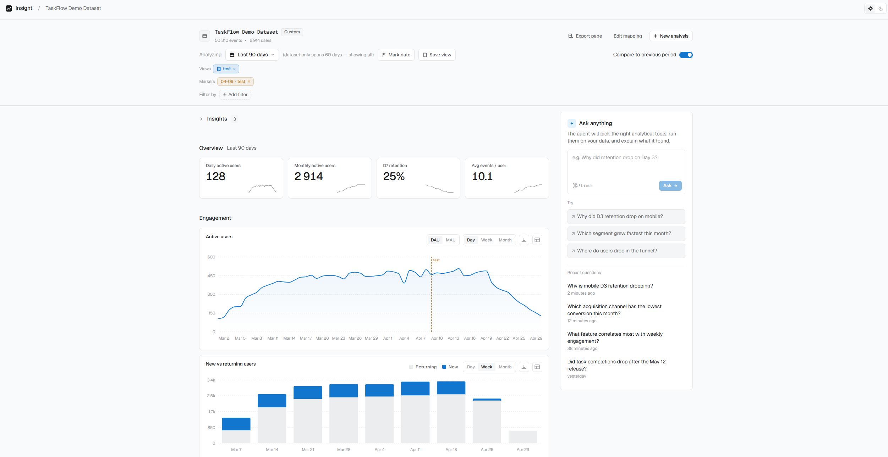
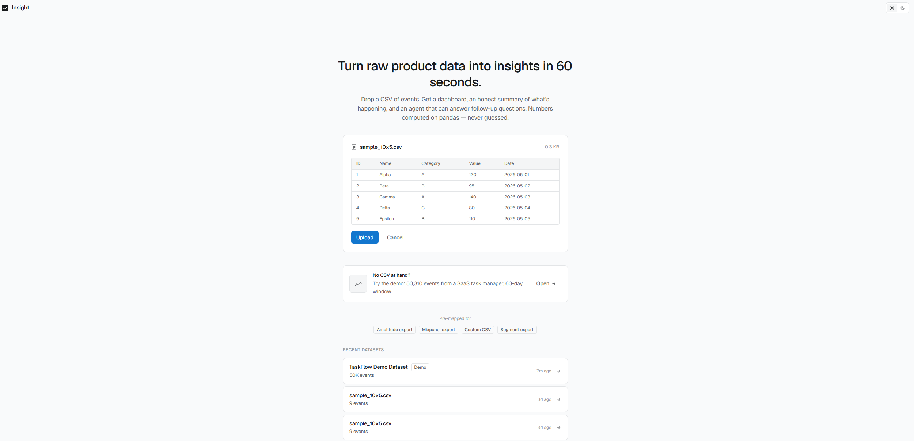
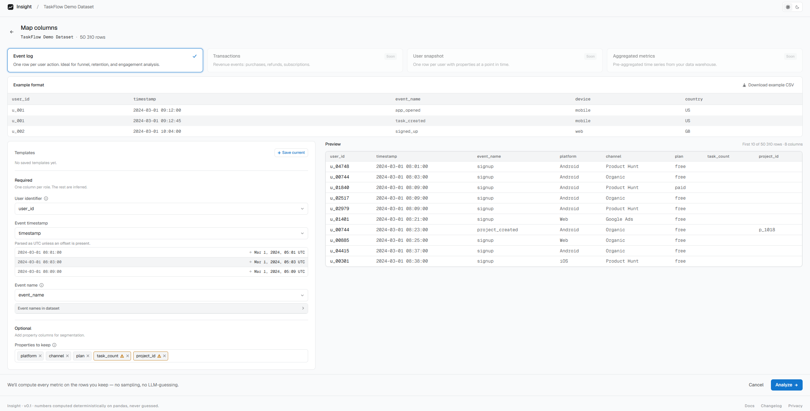
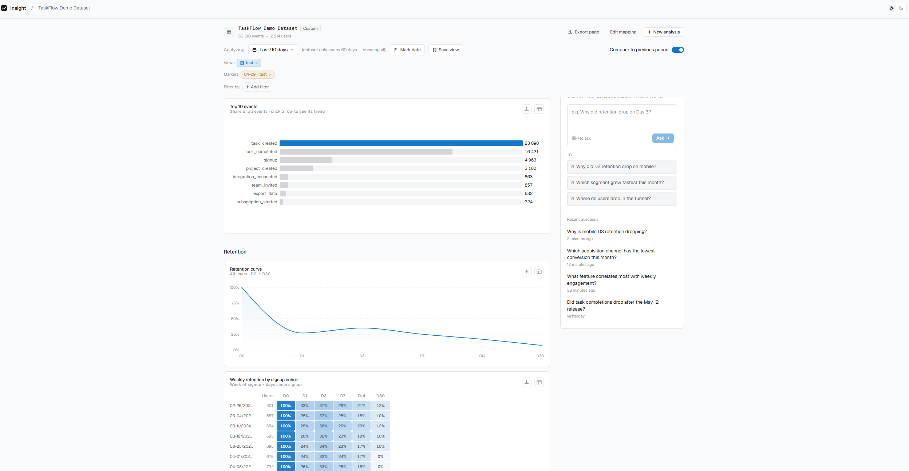
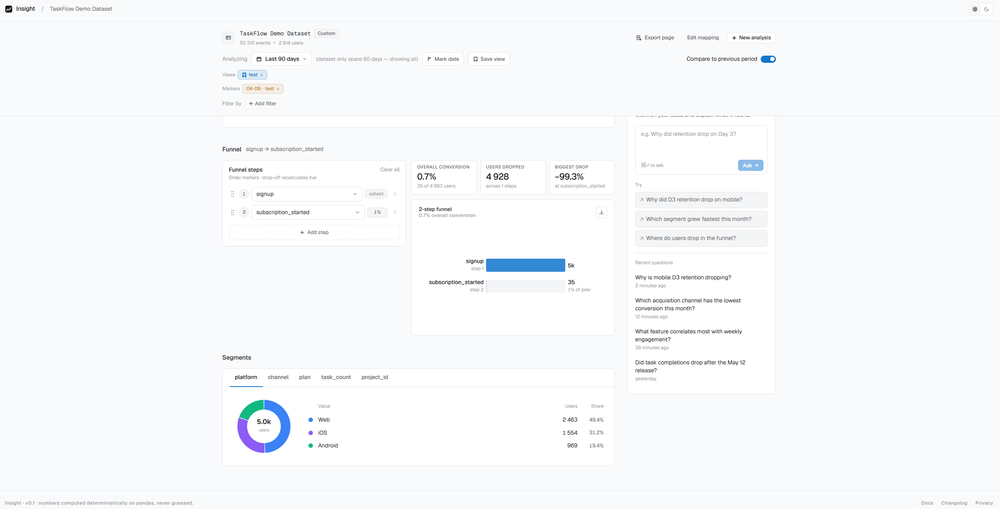
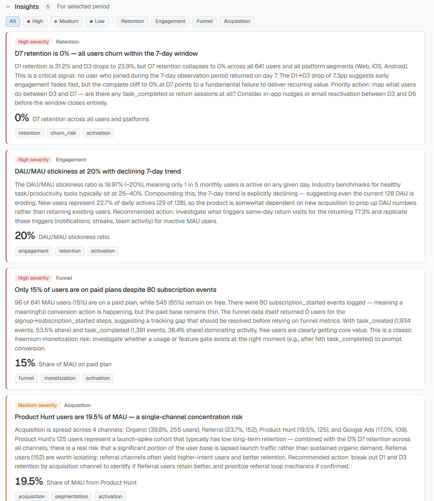
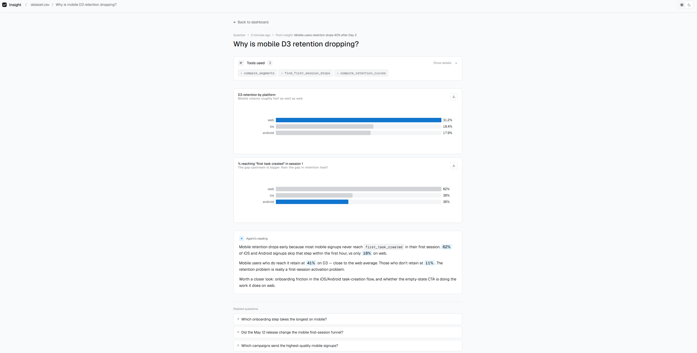

# Product Analytics Insights

> Upload a product event CSV → get an interactive dashboard and AI-generated insights in under a minute.



---

## Why I built this

Product managers routinely wait days for ad-hoc analytics — either queueing for a data team or wrestling with BI tools that weren't built for exploration. I wanted to see how far a small focused tool could go: parse raw events, run the standard product analytics suite (engagement / retention / funnel / segments), and let an LLM do the part PMs actually want — turn numbers into a short list of "here's what's interesting, and here's what to do about it."

---

## Highlights

- **Agentic Q&A** — natural-language follow-up questions handled by a Claude agent that calls analysis tools in a loop and grounds every answer in real data (no hallucinated numbers)
- **Structured AI insights via tool use** — Claude returns insights as a typed JSON schema (severity, category, tags, metric callout), not free-form text — so the UI can render them as proper cards instead of a blob
- **Non-blocking analysis pipeline** — four analyzers run in parallel on a thread pool, then AI insights and standard time windows (7/14/30/90d) precompute in the background so window switching is instant
- **Zero-config column mapping** — heuristic auto-detection of `user_id` / `timestamp` / `event_name` columns; any extra column becomes a segmentation dimension automatically
- **Built end-to-end** — React 18 + TypeScript + Tailwind v4 frontend, FastAPI + Pandas backend, Docker for one-command setup

---

## Features

The flow follows four steps: **upload → map → analyze → ask**.

### 1. Upload your event CSV



Drop any CSV of product events and get a live preview of the first rows before you commit. No CSV at hand? One click on **Try demo** loads a built-in 50,310-event / 60-day SaaS dataset. The page also pre-detects exports from **Amplitude, Mixpanel, Segment**, or any custom CSV, and remembers your recent uploads.

### 2. Map columns to standard fields



The mapping screen auto-detects `user_id`, `timestamp`, and `event_name` from common column patterns and shows a live preview of the mapped rows on the right. Any extra columns you keep (platform, country, plan, etc.) automatically become segmentation dimensions on the dashboard. Most datasets confirm in two clicks.

### 3. Explore the dashboard

#### Engagement


A sticky toolbar lets you switch time windows (7 / 14 / 30 / 90 days, custom range, or "all data"), apply property filters, and toggle **Compare to previous period**. The right rail keeps the AI insights and the agent's "Ask anything" box always in reach.

The Engagement section computes DAU / WAU / MAU, stickiness, and average events per user, then plots active users over time with annotations and a Day / Week / Month granularity toggle, plus a new-vs-returning breakdown.

#### Retention



Top-events horizontal bar chart with per-event click-through to the daily trend. The retention block computes a D-day curve (D1 / D3 / D7 / D14 / D30) and a weekly cohort heatmap so you can see whether retention is getting better or worse over time.

#### Funnel + segments



The funnel is a live builder: drag steps to reorder, pick any event for any step, and the per-step conversion + biggest drop recompute on the fly. Below it, segment breakdowns turn every kept property into a donut + share table with per-segment D7 retention attached.

### 4. AI-generated insights



Claude reads the full metric summary and returns 3–5 specific findings sorted by severity. Each card has a typed category, optional metric callout (e.g. "−15% share"), and tags — rendered as proper UI cards because the agent submits insights through a strict JSON schema rather than free-form text. Filter by severity / category, pin the ones that matter, dismiss the rest.

### 5. Ask follow-up questions



Click an insight or type a question in plain English ("Why is mobile D3 retention dropping?"). The agent picks the right analysis tools, runs them on the real DataFrame, and answers with exact numbers — no hallucinated figures. The tools accordion shows what was computed, inline charts render when the tool returns one, and the prose answer highlights key metrics. Related questions and a follow-up box let you keep digging in the same session.

---

## Tech stack

| Layer | Stack |
|---|---|
| Frontend | React 18, TypeScript, Vite, Tailwind CSS v4, Zustand, Recharts, React Router |
| Backend | FastAPI, Python 3.11, Pandas, asyncio |
| AI | Anthropic Claude (tool use for structured insights + agentic Q&A) |
| Infra | Docker + docker-compose |

---

## Quick start

### Docker (recommended)

```bash
git clone https://github.com/Gasparchik/product-analytics-insights.git
cd product-analytics-insights

cp .env.example .env
# Set ANTHROPIC_API_KEY in .env

docker-compose up
```

Open [http://localhost:5173](http://localhost:5173) and click **Try demo dataset**.

### Local dev

**Prerequisites:** Python 3.11+, Node 18+

**1. Backend** — from the project root:

```bash
# Create and activate a virtualenv
python -m venv .venv
source .venv/bin/activate          # Linux / macOS
.venv\Scripts\activate             # Windows PowerShell

pip install -r backend/requirements.txt

cp .env.example .env
# Set ANTHROPIC_API_KEY in .env

python -m uvicorn backend.main:app --reload
# → http://localhost:8000
```

Verify it's running: [http://localhost:8000/api/health](http://localhost:8000/api/health) should return `{"status":"ok"}`.

**2. Frontend** — in a **second terminal**:

```bash
cd frontend
npm install
npm run dev
# → http://localhost:5173
```

Open [http://localhost:5173](http://localhost:5173) and click **Try demo dataset**.

---

## Environment variables

| Variable | Required | Default | Description |
|---|---|---|---|
| `ANTHROPIC_API_KEY` | Yes | — | Without it, charts still work — AI insights and Q&A are skipped |
| `ALLOWED_ORIGINS` | No | `http://localhost:5173,http://localhost:3000` | Comma-separated CORS origins |
| `ENVIRONMENT` | No | `development` | `development` or `production` |

---

## CSV format

Any CSV with at least three columns works. Mapping happens during onboarding:

| Role | Example column names auto-detected |
|---|---|
| User identifier | `user_id`, `userId`, `uid` |
| Timestamp | `timestamp`, `created_at`, `event_time` |
| Event name | `event_name`, `event`, `action` |

Extra columns (platform, country, plan, etc.) become segment dimensions automatically.

---

## Architecture notes

**Non-blocking analysis pipeline.** When you click Analyze, the four metric analyzers run in parallel on a `ThreadPoolExecutor` and the API returns in 1–3 seconds for typical datasets. AI insight generation and pre-computation of the 7 / 14 / 30 / 90-day time windows happen in an `asyncio.create_task` so they don't block the response. A toast notification surfaces when background insights are ready. Window switches that hit pre-computed cache are instant.

**Agentic Q&A loop.** The Q&A agent runs in a FastAPI `BackgroundTasks` task and loops up to 6 turns. Each turn the agent picks tools from a registry (retention lookup, funnel recompute, segment filter, etc.), the backend executes them on the in-memory DataFrame, and tool results flow back to Claude until it produces a final text answer. Every tool call (name, inputs, output preview, duration) is stored alongside the answer for full transparency.

**Structured insight output.** Insights are not generated as free-form text — Claude is forced to call a single `submit_insights` tool with a strict JSON schema (enum-constrained type / severity / category, optional metric callout). This makes the output reliably renderable as UI cards and lets the frontend sort / filter without fragile parsing.

**Caching.** Analysis results are stored as JSON on disk keyed by `source_id + date range`. Subsequent requests for the same window return immediately.

---

## Project structure

```
backend/
  api/          # FastAPI routes: sources, analysis, questions
  analyzers/    # Pandas-based metric computation (engagement, retention, funnel, segments)
  ai/           # Claude client, insights generator, Q&A tools
  demo/         # Demo dataset generator
  models/       # Pydantic models
  storage/      # JSON file storage layer

frontend/
  src/
    components/ # Upload, Mapping, Dashboard, Question pages + shared UI
    store/      # Zustand stores
    api/        # Typed API client
    pages/      # Route-level pages
```

---

Built by **Gaspar Nikogosyan** · [LinkedIn](https://www.linkedin.com/in/gaspar-nikogosyan/) · [gasparnikogosyan@gmail.com](mailto:gasparnikogosyan@gmail.com)
